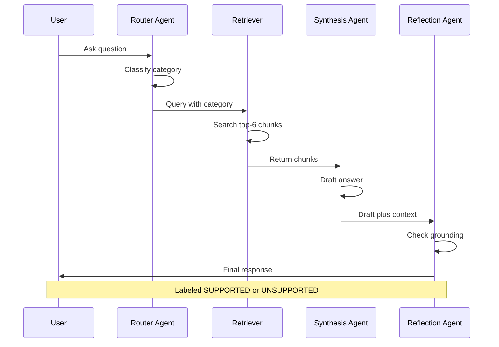

Sri Lanka Uni Admission Guide

 Project Description

UGC Admission & Z-Score Eligibility Explainer is an Agentic AI application developed to help Sri Lankan G.C.E. Advanced Level students understand university admission eligibility requirements, Z-score cut-offs, district quota systems, and UGC admission policies.

The system uses Retrieval-Augmented Generation (RAG) with multiple AI agents to provide accurate answers based on official University Grants Commission (UGC) documents. Instead of relying only on the parametric knowledge of Large Language Models, this application retrieves information directly from official UGC documents to generate reliable, context-grounded responses.

*Knowledge Base Documents:
- UGC Admission Handbooks
- Faculty Admission Requirements
- Z-score Reports
- Policy Notices

*Example Questions Handled:
- What subject combination is required for Engineering?
- How does the district quota system work in Sri Lanka?
- What is the Z-score requirement for a given course and district?
- What is the minimum mark required in the Common General Paper?
- Which universities offer a given degree programme?

 System Architecture Workflow

1. User submits a query through the Streamlit Web Interface.
2. Router Agent (Groq Llama 3.1 8B Instant) classifies the question category.
3. ChromaDB Vector Database performs semantic similarity search across embedded UGC document chunks.
4. Top matching retrieved document chunks are sent to the Retrieval & Synthesis Agent.
5. Synthesis Agent (Claude Sonnet 4.5 via OpenRouter) generates an answer grounded strictly in the retrieved context.
6. Reflection Agent (Groq Llama 3.1 8B Instant) validates the generated response against source context.
7. Final validated response is displayed to the user.

 Architecture Diagram


 Technology Stack

- *Programming Language: Python 3.10+
- *Frontend Framework: Streamlit
- *Agent / RAG Framework: LangChain
- *Router & Reflection Model: Llama 3.1 8B Instant (Groq)
- *Synthesis / Generation Model:Claude Sonnet 4.5 (OpenRouter)
- *Embedding Model: sentence-transformers/all-MiniLM-L6-v2
- *Vector Database: ChromaDB
- *PDF Processing: PyPDFLoader
- *Text Chunking: RecursiveCharacterTextSplitter

 Project Structure

```
ugc-admission-explainer
|-- app.py
|-- requirements.txt
|-- README.md
|-- .gitignore
|-- split_handbook.py
|-- data
|   |-- handbooks
|   |-- faculty_sections
|   |-- zscore_reports
|   |-- policy_notices
|   |-- qa_eval
|-- notebooks
|   |-- rag_agent_pipeline.ipynb
|-- .streamlit
    |-- secrets.toml   (not committed — see .gitignore)
```

 Setup & Installation Instructions

1. Clone Repository:
```
git clone https://github.com/Ayesha200352/ugc-admission-explainer.git
cd ugc-admission-explainer
```

2. Create Virtual Environment:

Windows:
python -m venv venv
venv\Scripts\activate

Linux / macOS:
python3 -m venv venv
source venv/bin/activate

3. Install Dependencies:
pip install -r requirements.txt

4. Configure API Keys:
Create a file at `.streamlit/secrets.toml` and add your API credentials:
toml
GROQ_API_KEY="YOUR_GROQ_API_KEY"
OPENROUTER_API_KEY="YOUR_OPENROUTER_API_KEY"

5. Run Application Locally:
streamlit run app.py
Access the application at http://localhost:8501

 Model Choice Comparison Table

| Sub-task | Model (Provider) | Reason Selected | Trade-Offs & Alternatives |
|---|---|---|---|
| Intent Routing & Classification | Llama 3.1 8B Instant (Groq) | Near-instant response time and low-cost overhead for high-speed intent routing. | Lower deep-reasoning capacity, but sufficient for simple text classification. |
| Deep Reasoning & Final Synthesis | Claude Sonnet 4.5 (OpenRouter) | Strong document synthesis, precise constraint-following, low hallucination rate on policy text. | Higher token cost and latency compared to smaller open models; `max_tokens` capped at 500 to manage cost. |
| Reflection / Self-Critique | Llama 3.1 8B Instant (Groq) | Fast execution for checking whether generated claims are supported by retrieved chunks. | A larger reasoning model was not used here, to keep the pipeline fast and low-cost. |

*Note: the initial synthesis model choice, `anthropic/claude-3.5-sonnet`, was found to be deprecated on OpenRouter during testing (404 error) and was replaced with the current equivalent, `anthropic/claude-sonnet-4.5`.

 Model Selection Strategy

The pipeline deliberately pairs two distinct AI models to optimize efficiency, latency, and cost:

1. Llama 3.1 8B Instant (Groq): Handles high-frequency, low-complexity tasks — classifying incoming questions (`zscore_lookup`, `eligibility_question`, `general_faq`) and running fast binary self-critique checks (`SUPPORTED` / `UNSUPPORTED`).
2. Claude Sonnet 4.5 (OpenRouter): Handles context-heavy generation where accuracy is critical, synthesizing answers strictly from retrieved UGC document chunks.

Agent Communication Flow

mermaid
sequenceDiagram
    participant U as User
    participant R as Router Agent (Groq)
    participant T as Retriever Tool (ChromaDB)
    participant S as Synthesis Agent (OpenRouter)
    participant F as Reflection Agent (Groq)

    U->>R: question (string)
    R->>R: classify category
    R-->>T: {"query": "...", "category": "eligibility_question"}
    T->>T: similarity search (k=6)
    T-->>S: retrieved chunks + sources
    S->>S: generate grounded answer
    S-->>F: {"answer": "...", "context": "...", "sources": [...]}
    F->>F: check answer vs context
    F-->>U: {"reflection_check": "SUPPORTED"} + final answer


*Agent Responsibilities:
- Router Agent: classifies the incoming question into a category, producing a structured message for Agent 2.
- Retrieval & Synthesis Agent: retrieves relevant chunks from ChromaDB (tool-use pattern) and synthesizes an answer using only that context.
- Reflection Agent: acts as an auditor, checking whether the synthesized answer is actually supported by the retrieved context (reflection/self-critique pattern).

 RAG Pipeline Explanation

1. Document Loading:PDF files are extracted page-by-page using LangChain's `PyPDFLoader`, from pre-extracted faculty sections, Z-score reports, and policy notices (extracted from the full UGC handbooks using `split_handbook.py` to avoid duplicating content already present in the full handbooks).
2. Chunking Strategy: Text is chunked using `RecursiveCharacterTextSplitter` (`chunk_size=300`, `chunk_overlap=50`). This size was chosen after comparing 300/600/1000-character configurations — smaller chunks kept individual course-eligibility entries intact, while the 1000-character configuration was observed to merge unrelated course entries into a single chunk.
3. Embeddings: Text chunks are converted into dense vector representations using `sentence-transformers/all-MiniLM-L6-v2` (a free, local embedding model — chosen to avoid embedding-API costs at this corpus scale).
4. Vector Store: Embeddings are indexed in ChromaDB for similarity search.
5. Retrieval: Top 6 (`k=6`) semantic matches are fetched per query. `k` was increased from an initial value of 3 to 6 after testing showed that table-formatted Z-score data was sometimes fragmented across more than 3 chunks.


Retrieval Evaluation

Five test queries were run against the deployed pipeline, and the resulting agent behaviour (router category, retrieved sources, and reflection check) was recorded:

| No. | Query | Router Category | Reflection Result | Comments |
|---|---|---|---|---|
| 1 | "What subject combination is required for a Bio Science degree?" | eligibility_question | UNSUPPORTED | Retriever returned chunks mostly from the Engineering section instead of Bio Science, likely due to overlapping science-stream terminology. The reflection agent correctly flagged the resulting answer as unsupported by context, preventing a misleading answer from reaching the user. |
| 2 | "What Z-score was required for Engineering in the Colombo district in 2024?" | zscore_lookup | SUPPORTED | Retrieved context did not contain the specific numeric value; the model honestly reported this rather than fabricating a number. |
| 3 | "How does the district quota system work?" | eligibility_question | SUPPORTED | Correctly retrieved and explained the 40% All-Island Merit / 55% District Quota system from policy_notices. |
| 4 | "What is the minimum mark required in the Common General Paper?" | eligibility_question | SUPPORTED | Correctly retrieved and quoted the 30% minimum mark requirement with source attribution. |
| 5 | "Which universities offer Engineering degrees?" | general_faq | SUPPORTED | Correctly listed relevant universities from the Z-score cutoff report source. |

*Observation: 4 of 5 queries (80%) were retrieved and answered correctly and confirmed as context-supported. The one failure case (Query 1) demonstrates the practical value of the reflection pattern: rather than the retrieval failure silently producing a wrong answer, the self-critique step caught the mismatch between the answer and its supporting context and flagged it — this was subsequently one motivation for increasing `k` from 3 to 6.

 Feature Branch Workflow & Git Practice

Development began on a single feature branch, `feature/rag-pipeline`, with 6 incremental, semantically-tagged commits covering corpus preparation, RAG pipeline construction, agent orchestration, and the Streamlit UI. This branch was merged into `main` via Pull Request #1.

Subsequent documentation corrections and diagram additions were made on a separate branch, `docs/readme-diagrams-and-fixes`, merged via a follow-up Pull Request, establishing a per-feature branch practice for ongoing work.

*Commit history (feature/rag-pipeline):
- `feat: add data folder structure for corpus and retrieval eval queries`
- `feat: extract faculty sections and Z-score cutoffs from handbook via split_handbook.py`
- `feat: extract Section 1 admissions policy and Arts stream from handbook`
- `feat: extract second-year Z-score cutoffs from 2025/2026 handbook`
- `feat: implement 3-pattern agent architecture (router, RAG tool-use, reflection) with Groq + OpenRouter models`
- `feat: add Streamlit UI wrapping the full agent pipeline`

All commits use semantic prefixes (`feat:`, `docs:`) and represent genuine incremental progress rather than a single bulk upload.

 Live Streamlit Demo

*Live Application URL: https://ugc-admission-explainer-zddzrkf9bnjqk4qvb5eusa.streamlit.app/

 Known Limitations

- Scanned Image PDFs: PDFs consisting purely of scanned images without OCR text cannot be read by PyPDFLoader and would require pre-processing (not encountered in this corpus, since all source PDFs contain a text layer).
- Complex Tables: Multi-column statistical tables in Z-score reports can occasionally lose alignment during plain-text extraction and character-based chunking, which can fragment a district/course-specific value away from its retrievable context (see Retrieval Evaluation, Query 1 and 2).
- Vector Store Persistence: The ChromaDB vector store is rebuilt on each cold start of the Streamlit app rather than persisting between deployments, since Streamlit Community Cloud does not guarantee persistent disk storage between restarts.
- Strict Scope Boundary: The assistant is restricted to the provided UGC documents and will decline to answer out-of-scope general knowledge questions.

 Future Improvements

- Add multilingual query support for Sinhala and Tamil.
- Implement hybrid search (BM25 keyword search + dense vector search) to improve retrieval of tabular Z-score data.
- Use table-aware PDF extraction for Z-score report chunking, rather than plain character-based splitting.
- Add multi-turn conversational memory for follow-up questions.
